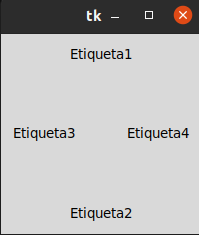
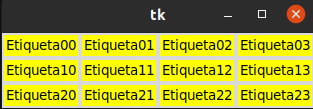
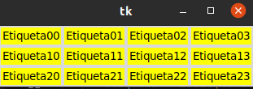
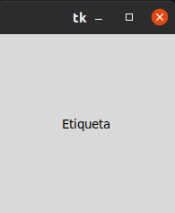

# 1. POSICIONAMIENTO Y DISEÑO 

## Gestor de geometria pack 

### Este gestor de geometría distribuye los widgets en horizontal o en vertical.

## Gestor de geometria Grid

### Con grid la distribución de los widgets se realiza de una manera mas flexible, utilizando un diseño de cuadrícula. De esta manera, cada widget en la celta determinada por la intersección de una fila y una columa. 

## Gestor de geometria Place

### Este gestor permite colocar los widgets en coordenadas especificas de la ventana principal o del widget contenedor.

