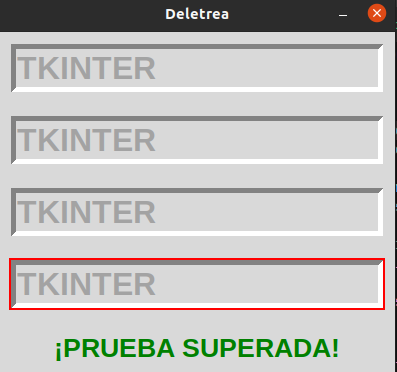
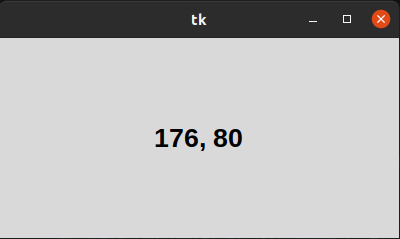
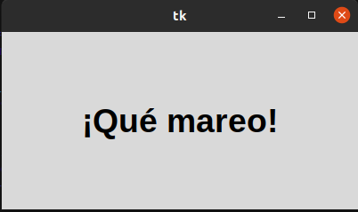
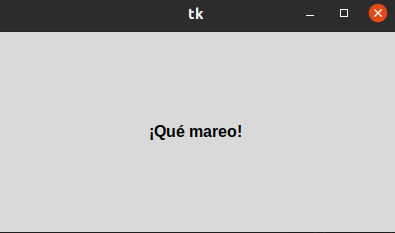

# 2. METODOS COMUNES

## Foco

### Este metodo consite en completar la frase "Tkinter" en cada una de las celdas en las que se rota la celda aleatoriamente.

## Posicion de Raton

### Este metodo permite saber la posicion exacta del cursor del mouse. 

## Temporizadores

### Con metodo se puede aumentar y disminuir el tamaño del texto de manera continua hasta no cerrar la ventana. 

