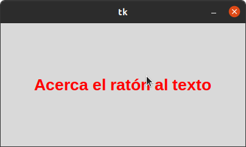

# 5. Canvas

## Poligono 

### Se realizo un poligono con canvas.

## Circulo

### Se realizo un circulo con canvas que se mueve por la ventana.

## Lineas

### Se hizo una cuadricula con canvas, estas lineas son verticales y horizontales.

## Rectangulo

### Se creo un rectangulo con canvas. 

## Texto

### EL texto cambia de color cuando el cursor del mouse se acerca. 

## Dibujo

### Se hizo un dibujo de Pac-Man con canvas. 

## Ángulo

### El programa dibuja el ángulo según se le indique.

## Imagen de pelota moviendose

### Una imagen de una pelota moviendose por la ventana.

