# 3. WIDGETS

## Cronometro

### Este programa permite contabilizar el tiempo. 

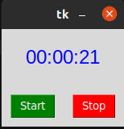

## Inicio de Sesion

### Programa para acceder a la cuenta

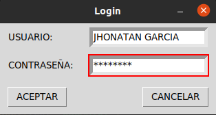

## Reloj

### Este programa proporciona la hora. 

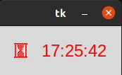

## Traductor

### Este programa cambia la palabra "HOLA" a otros idomas como, Italiano, Ingles, Frances y Alemán.

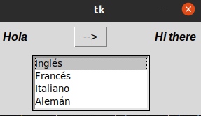

##  Menú

### Ventana con varias opciones. 

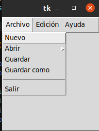

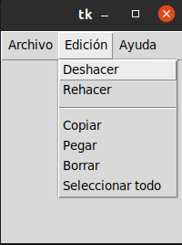

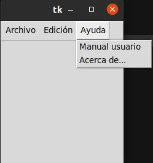

## Mensaje de Informacion

### Proporciona un mensaje cuando se quiere mirar " acerca de.. " y " manual de usuario ".

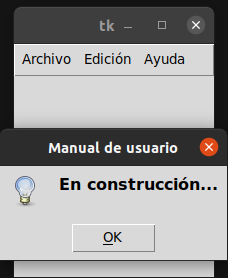

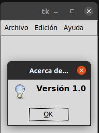

## Ángulo

### El programa dibuja el ángulo según se le indique.

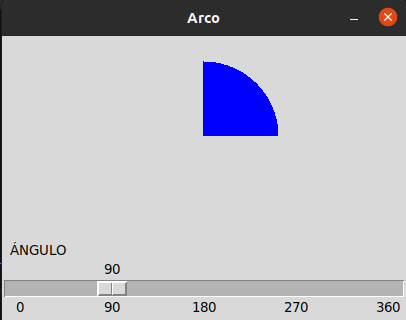

## Formularios

### Permite llenar un pequeño formulario.

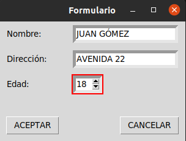

### Permite llenar el formulario con varias preguntas. 

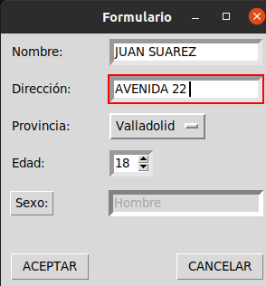

## Texto

### Permite escribir cualquier texto y luego guardarlo.

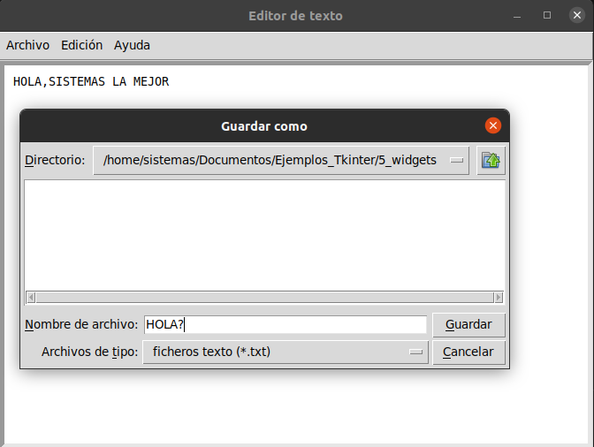